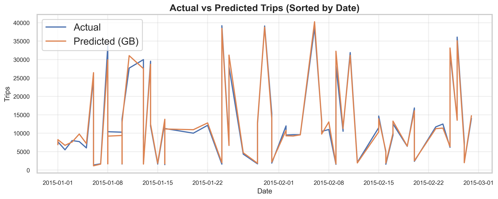
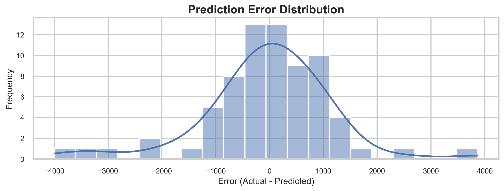
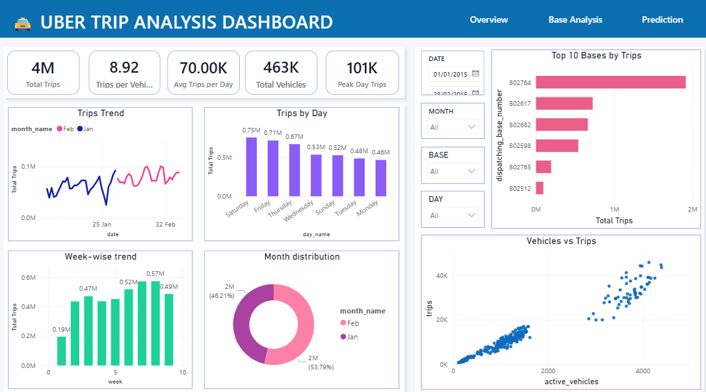

# Uber Trip Analysis using Machine Learning

This project analyzes Uber trip demand using historical trip data (Jan–Feb).  
It focuses on identifying demand patterns over time, the relationship between trips and active vehicles, and finally builds a machine learning model to predict trip demand.

---

## What this project includes

- Data cleaning and preprocessing
- Exploratory Data Analysis (EDA)
- Demand trend visualizations
- Relationship analysis between trips and active vehicles
- Machine Learning model for trip demand prediction
- Model evaluation and performance plots

---

## Dataset

The dataset contains daily records with fields like:
- `date`
- `trips`
- `active_vehicles`

---

## Tools used

- Python
- Jupyter Notebook
- Pandas, NumPy
- Matplotlib, Seaborn
- Scikit-learn (for ML)

---

## Main analysis / graphs

### EDA
- Daily Trips Trend
- Active Vehicles Trend
- Trips vs Active Vehicles (relationship)
- Weekday-wise Demand Analysis
- Correlation Heatmap
- Moving Average Trend (7-day)

### ML
- Actual vs Predicted Trips (model performance)
- Error distribution / residual analysis

(All output charts are saved in the `images/` folder.)

---

## Key insights

- Uber trip demand changes significantly across days, with clear peak periods.
- Active vehicles generally increase during higher demand days, showing supply adjustment.
- Trips and active vehicles have a positive relationship (higher vehicles → higher fulfilled demand).
- Weekday analysis helps identify high-demand days for better planning.
- The ML model is able to capture demand patterns and predict trips with reasonable accuracy.

---

## Folder structure

Uber-Trip-Analysis-ML/
|── powerbi_dashboard/
│── notebook/
│── data/
│── images/
│ ├── eda/
│ └── ml/
│── requirements.txt
│── README.md
│── .gitignore

---

## Sample Visualizations

---

## Power BI Dashboard 

A professional **Power BI dashboard** has been created with interactive navigation tabs:

✅ **Overview** (KPIs + Trend + Weekday + Month distribution + Top bases)  
✅ **Base Analysis** (Top bases + Heatmap + Base contribution + Trend by base)  
✅ **Prediction** (Trips forecast + Breakdown analysis + Key influencers)

- Dashboard file:
- `powerbi_dashboard/Uber_Trip_Analysis_Dashboard.pbix`

---

## Power BI Dashboard Screenshots

### Overview

### Base Analysis

### Prediction

---

## Author 

**Aparna Patel**
